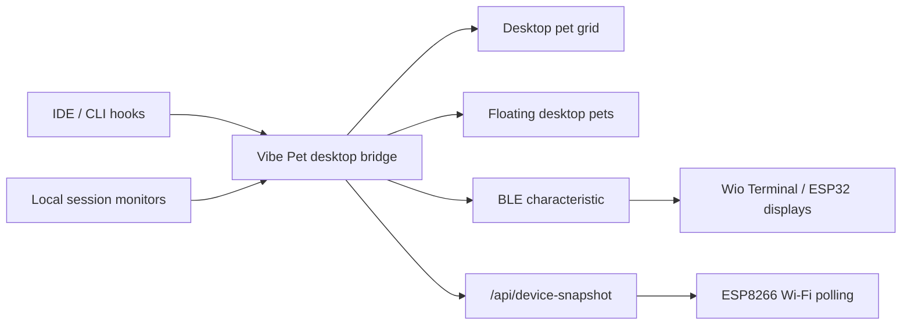

# Vibe Pet Protocols

Vibe Pet has two protocol surfaces:

| Protocol | Direction | Documentation |
| --- | --- | --- |
| IDE / Agent Protocol | IDEs, CLIs, hooks, and plugins send normalized session activity into the local Vibe Pet bridge. | [English](ide-protocol.md) / [中文](ide-protocol.zh-CN.md) |
| Hardware Protocol | The desktop bridge sends compact pet state to BLE and Wi-Fi display hardware. | [English](hardware-protocol.md) / [中文](hardware-protocol.zh-CN.md) |

The bridge keeps these two surfaces separate on purpose. IDE integrations can report rich local session state, while hardware receives a small display-safe packet with state, agent label, session title, and selected character identity.

